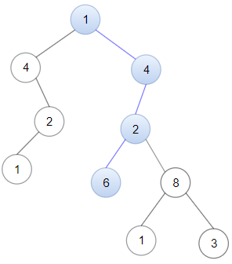

**1367. Linked List in Binary Tree**

```Tag : dfs/linked list/tree```

**Description:**

Given a binary tree ```root``` and a linked list with ```head``` as the first node. 

Return ```True``` if all the elements in the linked list starting from the ```head``` correspond to some downward path connected in the binary tree otherwise return ```False```.

In this context downward path means a path that starts at some node and goes downwards.

**Example1:**


        Input: head = [4,2,8], root = [1,4,4,null,2,2,null,1,null,6,8,null,null,null,null,1,3]
        Output: true
        Explanation: Nodes in blue form a subpath in the binary Tree.  

**Example2:**



        Input: head = [1,4,2,6], root = [1,4,4,null,2,2,null,1,null,6,8,null,null,null,null,1,3]
        Output: true

**Example3:**

        Input: head = [1,4,2,6,8], root = [1,4,4,null,2,2,null,1,null,6,8,null,null,null,null,1,3]
        Output: false
        Explanation: There is no path in the binary tree that contains all the elements of the linked list from head.

**Hints**:

+ Create recursive function, given a pointer in a Linked List and any node in the Binary Tree. Check if all the elements in the linked list starting from the head correspond to some downward path in the binary tree.

-----------

```python
# Definition for singly-linked list.
# class ListNode:
#     def __init__(self, val=0, next=None):
#         self.val = val
#         self.next = next

# Definition for a binary tree node.
# class TreeNode:
#     def __init__(self, val=0, left=None, right=None):
#         self.val = val
#         self.left = left
#         self.right = right
class Solution:
    def isSubPath(self, head: Optional[ListNode], root: Optional[TreeNode]) -> bool:
        """
        We will adopt a DFS-recursion approach in solving this problem
        Essentially, we will simplify this problem to
        Given the tree root node and the head of a linked list node
        Starting from exactly this root node, 
        is it possibly to find a continuous downward path for this linked list
        We apply above such procedure to root tree node and its left-subtree & right-subtree recursively
        
        denote L := length of the linked list, N := number of nodes in this binary tree
        Time Complexity : O(N*L)
        Space Complexity : O(L) recursion stack for dfs is at most L height
        """
        
        def dfs(list_node: "ListNode", tree_node: "TreeNode") -> bool:
            """
            O(L)
            Helper function: check if starting from the tree_node, 
            is the linked list a downward path in the subtree
            """
            if not list_node:
                return True
            elif not tree_node:
                return False
            elif tree_node.val != list_node.val:
                return False
            else:
                left = dfs(list_node.next, tree_node.left)
                if left: # might have chance to save half of computations
                    return left
                right = dfs(list_node.next, tree_node.right)
                return right
            
        if not head:
            return True
        elif not root:
            return False
        else:
            # isSubPath procedure is called at most O(N) times
            curr_result = dfs(head, root)
            if curr_result: # the current tree root equals linked list head
                return True
            left_result = self.isSubPath(head, root.left)
            right_result = self.isSubPath(head, root.right)
            return left_result or right_result
```


