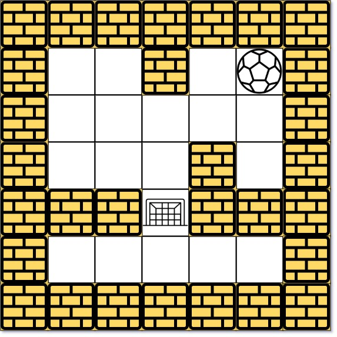

**490. The Maze**

```Tag : bfs/dfs/graph```

**Description:**

There is a ball in a ```maze``` with empty spaces (represented as ```0```) and walls (represented as ```1```). The ball can go through the empty spaces by rolling **up, down, left or right**, but it won't stop rolling until hitting a wall. When the ball stops, it could choose the next direction.

Given the ```m x n``` maze, the ball's ```start``` position and the ```destination```, where ```start = [start_row, start_col]``` and ```destination = [destination_row, destination_col]```, return ```true``` if the ball can stop at the destination, otherwise return ```false```.

You may assume that the **borders of the maze are all walls** (see examples).

**Example1:**


        Input: maze = [[0,0,1,0,0],[0,0,0,0,0],[0,0,0,1,0],[1,1,0,1,1],[0,0,0,0,0]], start = [0,4], destination = [4,4]
        Output: true
        Explanation: One possible way is : left -> down -> left -> down -> right -> down -> right.

**Example2:**



        Input: maze = [[0,0,1,0,0],[0,0,0,0,0],[0,0,0,1,0],[1,1,0,1,1],[0,0,0,0,0]], start = [0,4], destination = [3,2]
        Output: false
        Explanation: There is no way for the ball to stop at the destination. Notice that you can pass through the destination but you cannot stop there.
        
**Example3:**

        Input: maze = [[0,0,0,0,0],[1,1,0,0,1],[0,0,0,0,0],[0,1,0,0,1],[0,1,0,0,0]], start = [4,3], destination = [0,1]
        Output: false

-----------

```python
class Solution:
    def hasPath(self, maze: List[List[int]], start: List[int], destination: List[int]) -> bool:
        """
        This is a normal dfs/bfs problem. We adopt a bfs approach here
        The only difference is that, in rollin the ball we must hit the wall before we can stop
        
        denote n, m := maze.shape
        there are actually limited positions on the maze that can be reached, must lean the wall
        Time Complexity : O(n*m)
        Space Complexity : O(n*m)
        """
        from collections import deque
        def move(ball: Tuple[int, int], direction: Tuple[int, int]) -> Tuple[int, int]:
            """Helper function: rolling the ball in a direction specified"""
            ball_x, ball_y = ball
            dx, dy = direction
            while 0 <= ball_x + dx < n and \
                  0 <= ball_y + dy < m and \
                  maze[ball_x+dx][ball_y+dy] != 1:
                ball_x += dx
                ball_y += dy
            return (ball_x, ball_y)

        n, m = len(maze), len(maze[0])
        directions = [(0, 1), (0, -1), (1, 0), (-1, 0)] # possible move direction
        start = (start[0], start[1])
        destination = (destination[0], destination[1])
        queue = deque([start])
        visited = set()
        while queue:
            ball = queue.popleft()
            if ball == destination:
                # found and stop at destination, finish
                return True
            visited.add(ball)
            for d in directions:
                # move till the ball hit the wall
                next_move = move(ball, d)
                if next_move not in visited:
                    queue.append(next_move)
        # failure
        return False
```

