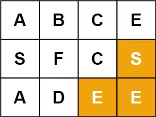

**79. Word Search**

```Tag: DFS```

**Description:**

Given an ```m x n``` grid of characters ```board``` and a string ```word```, return ```true``` if ```word``` exists in the grid.

The word can be constructed from letters of sequentially adjacent cells, where adjacent cells are horizontally or vertically neighboring. The same letter cell may not be used more than once.

**Follow up**: Could you use search pruning to make your solution faster with a larger board?

**Example1**:


        Input: board = [["A","B","C","E"],["S","F","C","S"],["A","D","E","E"]], word = "ABCCED"
        Output: true


**Example2**:



        Input: board = [["A","B","C","E"],["S","F","C","S"],["A","D","E","E"]], word = "SEE"
        Output: true


**Example3**:


        Input: board = [["A","B","C","E"],["S","F","C","S"],["A","D","E","E"]], word = "ABCB"
        Output: false

-----------

```python
class Solution:
    def exist(self, board: List[List[str]], word: str) -> bool:
        """
        A typical DFS problem, we run DFS search starting at every cell of this board
        denote m, n := board.shape, k = len(word)
        Time Complexity : O(m*n*3^k) there are m*n cell to be dfs searched, 
                            each step we can go to 3 positions(not including the position you are coming from)
                            and we go as farest as k steps to know if starting this cell yields a success
        Space Complexity : O(k) the recursion stack
        """
        self.success = False # flag var
        m, n = len(board), len(board[0])
        
        def dfs(row: int, col: int, ptr: int):
            if ptr == len(word): # success
                self.success = True
                return
            
            if not (0 <= row < m and 0 <= col < n) or (board[row][col] != word[ptr]): 
                # already beyond the board scope, or current char doesn't match
                return
            old_char = board[row][col]
            board[row][col] = '/' # indicate it's temporarily explored already
            dfs(row-1, col, ptr+1)
            dfs(row+1, col, ptr+1)
            dfs(row, col-1, ptr+1)
            dfs(row, col+1, ptr+1)
            board[row][col] = old_char # cancel operation


        # search each cell
        for i in range(m):
            for j in range(n):
                ptr = 0 # the pointer pointing to curr search position in the word
                dfs(i, j, ptr)
                if self.success: # find word
                    return True 
        return False 
```
