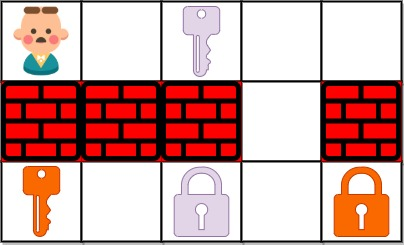

**864. Shortest Path to Get All Keys**

```Tag : bfs/graph```

**Description:**

You are given an ```m x n``` grid ```grid``` where:

+ ```'.'``` is an empty cell.

+ ```'#'``` is a wall.

+ ```'@'``` is the starting point.

+ Lowercase letters represent keys.

+ Uppercase letters represent locks.

You start at the starting point and one move consists of walking one space in one of the four cardinal directions. You cannot walk outside the grid, or walk into a wall.

If you walk over a key, you can pick it up and you cannot walk over a lock unless you have its corresponding key.

For some ```1 <= k <= 6```, there is exactly one lowercase and one uppercase letter of the first ```k``` letters of the English alphabet in the grid. This means that there is exactly one key for each lock, and one lock for each key; and also that the letters used to represent the keys and locks were chosen in the same order as the English alphabet.

Return the *lowest number of moves to acquire all keys*. If it is impossible, return ```-1```.


**Example1:**



        Input: grid = ["@.a.#","###.#","b.A.B"]
        Output: 8
        Explanation: Note that the goal is to obtain all the keys not to open all the locks.
        
**Example2:**


        Input: grid = ["@..aA","..B#.","....b"]
        Output: 6
        
**Example3:**


        Input: grid = ["@Aa"]
        Output: -1

-----------

```python

class Solution:
    def shortestPathAllKeys(self, grid: List[str]) -> int:
        """
        We use a BFS approach to simulate the search on the grids
        first we check the grids to store the location of keys and locks
        when we step into a lock and find we do have its key, 
        we just remove the lock from memory set, meaning this cell is clear to go
        
        denote m, n := grid.shape
        Time Complexity : O(4^{m*n}) at each location, you have 4 directions to go. In worst case, we will enumerate all possible paths with finite number of key states
        Space Complexity : O(m*n) 
        """
        from collections import deque
        m, n = len(grid), len(grid[0])
        count = 0
        for i in range(m):
            for j in range(n):
                if grid[i][j] == '@':
                    start_x, start_y = i, j
                elif grid[i][j] in 'abcdef': 
                    # we know there are at most 6 keys using first six lower letters
                    count += 1
      
        visited = set()
        queue = deque([(start_x, start_y, "", 0)])
        visited.add((start_x, start_y, ""))
        
        while queue:
            x, y, key, step = queue.popleft()
            if len(key) == count:
                # a successful search
                return step
            
            for next_x, next_y in [(x-1, y), (x+1, y), (x, y-1), (x, y+1)]:
                if not (0 <= next_x < m and 0 <= next_y < n) or grid[next_x][next_y] == '#':
                    # not valid position
                    continue
                next_key = key
                if grid[next_x][next_y] in 'abcdef':
                    if grid[next_x][next_y] not in key:
                        # a new key to be acquired
                        next_key = key + grid[next_x][next_y]
                elif grid[next_x][next_y] in 'ABCDEF':
                    if grid[next_x][next_y].lower() not in key:
                        # no key to lock, can not pass it currently
                        continue
                if (next_x, next_y, next_key) not in visited:
                    queue.append((next_x, next_y, next_key, step+1))
                    visited.add((next_x, next_y, next_key))
                        
        return -1
```
