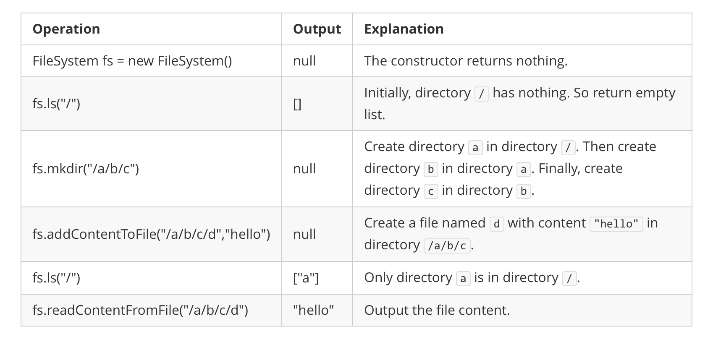

**588. Design In-Memory File System**

```Tag : design/hashtable/string```

**Description:**

Design a data structure that simulates an in-memory file system.

Implement the FileSystem class:

+ ```FileSystem()``` Initializes the object of the system.

+ ```List<String> ls(String path)```

	+ If path is a file path, returns a list that only contains this file's name.

	+ If path is a directory path, returns the list of file and directory names in this directory.

	+ The answer should in **lexicographic order**.

+ ```void mkdir(String path)``` Makes a new directory according to the given ```path```. The given directory path does not exist. If the middle directories in the path do not exist, you should create them as well.

+ ```void addContentToFile(String filePath, String content)```

	+ If filePath does not exist, creates that file containing given content.

	+ If filePath already exists, appends the given content to original content.

+ ```String readContentFromFile(String filePath)``` Returns the content in the file at ```filePath```.

**Example1:**



		Input
		["FileSystem", "ls", "mkdir", "addContentToFile", "ls", "readContentFromFile"]
		[[], ["/"], ["/a/b/c"], ["/a/b/c/d", "hello"], 		["/"], ["/a/b/c/d"]]
		Output
		[null, [], null, null, ["a"], "hello"]

		Explanation
		FileSystem fileSystem = new FileSystem();
		fileSystem.ls("/");                         // return []
		fileSystem.mkdir("/a/b/c");
		fileSystem.addContentToFile("/a/b/c/d", "hello");
		fileSystem.ls("/");                         // return ["a"]
		fileSystem.readContentFromFile("/a/b/c/d"); // return "hello"

-----------

```python
from collections import defaultdict

class Dir:
    """Helper class: Individual directory contains both files and subdirectory"""
    
    def __init__(self):
        self.directory = defaultdict(lambda: Dir())
        self.file = defaultdict(str)
        
class FileSystem:
    """
    Complexity Analysis:
    denote m := len(path string), n := number of levels nested, k := sum of number of file and directory at that level
    
    Time Complexity:
    ls() : O(m+n+klogk), O(m) for scan and split, O(n) for go deep into the subdirectory, O(klogk) for sorting in lexicographic order
    mkdir() : O(m+n)
    addContentToFile() : O(m+n)
    readContentFromFile() : O(m+n)
    
    Space Complexity:
    O(d+f+c), where d := total number of directory, f := total number of file, c := total content size of files
    """
    def __init__(self):
        # initialize root directory
        self.root = Dir()

    def ls(self, path: str) -> List[str]:
        curr_dir = self.root
        if path != '/':
            # not the plain root directory
            path_lst = path.split('/')
            for i in range(1, len(path_lst)-1):
                # we leave out the last one to check if it's a file or directory
                curr_dir = curr_dir.directory[path_lst[i]]
            if path_lst[-1] in curr_dir.file:
                # a file
                return [path_lst[-1]]
            else:
                # one level deeper
                curr_dir = curr_dir.directory[path_lst[-1]]
        combined_lst = []
        combined_lst.extend(curr_dir.directory.keys())
        combined_lst.extend(curr_dir.file.keys())
        combined_lst.sort() # sort in lexicographic order
        return combined_lst

    def mkdir(self, path: str) -> None:
        # utilize the key feature of defaultdict
        curr_dir = self.root
        if path != '/':
            path_lst = path.split('/')
            for i in range(1, len(path_lst)):
                curr_dir = curr_dir.directory[path_lst[i]]

    def addContentToFile(self, filePath: str, content: str) -> None:
        # traversal deeper until the last one for filename
        curr_dir = self.root
        path_lst = filePath.split('/')
        for i in range(1, len(path_lst)-1):
            curr_dir = curr_dir.directory[path_lst[i]]
        curr_dir.file[path_lst[-1]] += content
        

    def readContentFromFile(self, filePath: str) -> str:
        curr_dir = self.root
        path_lst = filePath.split('/')
        for i in range(1, len(path_lst)-1):
            curr_dir = curr_dir.directory[path_lst[i]]
        return curr_dir.file[path_lst[-1]]  
```
