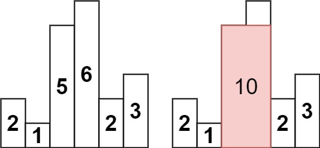

**84. Largest Rectangle in Histogram**

```Tag: dynamic programming/stack/monotone stack```

**Description:**

Given an array of integers ```heights``` representing the histogram's bar height where the width of each bar is ```1```, return the **area** of the *largest rectangle* in the histogram.

**Example1**:



		Input: heights = [2,1,5,6,2,3]
		Output: 10
		Explanation: The above is a histogram where width of each bar is 1.
		The largest rectangle is shown in the red area, which has an area = 10 units.
        
**Example2**:


		Input: heights = [2,4]
		Output: 4
        
-----------

**Solution1: Dynamic Programming (Time Limit Exceeds)**

```python
class Solution:
    def largestRectangleArea(self, heights: List[int]) -> int:
        """
        We could use a dynamic programming scheme to solve the problem
        we consider the largest rectangle with ending edge at index j, call it area_j
        we should have area_j = max((j-i)*min(heights[i:j+1])) for all i < j
        namely once we fix two sides of a rectangle, the height is the minimum height in between the two sides
        we could use a dynmaic programming skill to compute the minimum height in any heights[i:j] for any i < j pairs

        denote n := len(heights)
        Time Complexity : O(n^2)
        Space Complexity : O(n^2)
        """
        n = len(heights)
        # min_dp[i][j] (i <= j) represents the minimum height in heights[i:j+1], i.e. both end points i and j are included
        min_dp = [[float('inf')] * n for _ in range(n)]
        for i in range(n):
            for j in range(i, n):
                if j == i: # single element
                    min_dp[i][j] = heights[j]
                else:
                    min_dp[i][j] = min(heights[j], min_dp[i][j-1])
        # area[i] is the largest rectangle area with ending side be i (included)
        area = [0] * n
        for end_side in range(n):
            for start_side in range(end_side+1):
                width = end_side - start_side + 1
                height = min_dp[start_side][end_side]
                area[end_side] = max(area[end_side], width * height)
        # return the max area from all possible ending slide
        return max(area)    
```

-----------

**Solution2: Monotone Stack**

```python
class Solution:
    def largestRectangleArea(self, heights: List[int]) -> int:
        """
        The monotone stack approaches seeks to extend a height as far as possible,
            for an index i with height[i], going left the first j such that height[j] < height[i]
                                           going right the first k such that height[k] < height[i]
            then this height gives an area of height[i] * (k-j-1)
        The monotone stack utilize the fact that,
        if for such i1 and i2, i1 < i2 and height[i1] > height[i2]
        then for a later index i, when we want to find the first left height[left] < height[i]
        it's impossible to be i1, becasue if so, height[i2] < height[i1] < height[i] yet i2 > i1, so the first left would be i2
        in this way, we can maintain a stack of increasing index and height from stack bottom to stack top
        we do a two-pass traversal through the array

        denote n := len(heights)
        Time Complexity : O(n)
        Space Complexity : O(n)
        """
        n = len(heights)
        left, right = [0] * n, [0] * n
        mono_stack = []

        # find the first left lower position
        for i in range(n):
            while mono_stack and heights[mono_stack[-1]] >= heights[i]:
                mono_stack.pop()
            # use -1 as the left-most guard
            left[i] = mono_stack[-1] if mono_stack else -1
            mono_stack.append(i)
        
        # find thr first right lower position
        mono_stack.clear()
        for i in range(n-1, -1, -1):
            while mono_stack and heights[mono_stack[-1]] >= heights[i]:
                mono_stack.pop() 
            # use n as the right-most guard
            right[i] = mono_stack[-1] if mono_stack else n
            mono_stack.append(i)
        
        ans = [(right[i]-left[i]-1) * heights[i] for i in range(n)]

        return max(ans)
```

