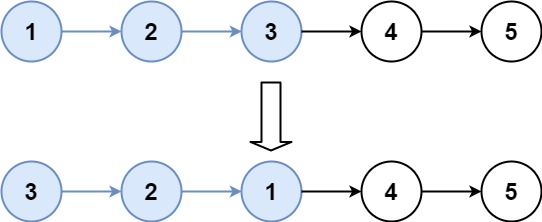

**25. Reverse Nodes in k-Group**

```Tag : Linked List```

**Description:**

Given a linked list, reverse the nodes of a linked list k at a time and return its modified list.

k is a positive integer and is less than or equal to the length of the linked list. If the number of nodes is not a multiple of k then left-out nodes, in the end, should remain as it is.

You may not alter the values in the list's nodes, only nodes themselves may be changed.

**Example1**:


        Input: head = [1,2,3,4,5], k = 2
        Output: [2,1,4,3,5]

**Example2**:



        Input: head = [1,2,3,4,5], k = 3
        Output: [3,2,1,4,5]
        
**Example3**:

        Input: head = [1,2,3,4,5], k = 1
        Output: [1,2,3,4,5]
        
**Example4**:

        Input: head = [1], k = 1
        Output: [1]

-----------

```python
# Definition for singly-linked list.
# class ListNode:
#     def __init__(self, val=0, next=None):
#         self.val = val
#         self.next = next
class Solution:
    
    def reverseKGroup(self, head: ListNode, k: int) -> ListNode:
        """
        We use recursion to move k-steps at a time
        split [0:k] and [k+1:], call recursion to finish the job
        
        Time Complexity : O(n)
                        will reverse [n/k] groups, each takes O(k) time
        Space Complexity : O(1)
        """
        temp = head
        for i in range(k-1):
            # try to make k-steps
            # stop at the end of k-sequence
            # we need both end and next-head
            if temp != None:
                temp = temp.next
                
        if not temp: # left-over group, no need to reverse
            return head
        
        next_head = temp.next # the [k+1:] part
        temp.next = None # split the [0:k] and [k+1:]
        new_head = self.reverseList(head) # after reverse [0:k]
        new_next_head = self.reverseKGroup(next_head, k) # after reverse [k+1:]
        head.next = new_next_head # original head is the end of reversed [0:k] now
        
        return new_head
        
    def reverseList(self, head: ListNode) -> ListNode:
        """
        Helper function: to completely reverse a linked-List
        Iterative pointer-based
        """
        if not head or not head.next:
            return head
        prev, curr = None, head
        while curr:
            after = curr.next
            curr.next = prev
            prev, curr = curr, after
        
        # when out of loop, curr=None, so prev is the end of linkedList
        return prev
```
