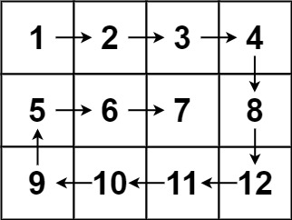

**54. Spiral Matrix**

```Tag: Math/Matrix```

**Description:**

Given an ```m x n``` matrix, return all elements of the matrix in **spiral order**.

**Example1**:


        Input: matrix = [[1,2,3],[4,5,6],[7,8,9]]
        Output: [1,2,3,6,9,8,7,4,5]

**Example2**:



        Input: matrix = [[1,2,3,4],[5,6,7,8],[9,10,11,12]]
        Output: [1,2,3,4,8,12,11,10,9,5,6,7]

-----------

```python
class Solution:
    def spiralOrder(self, matrix: List[List[int]]) -> List[int]:
        """
        Our solution mimics how to "Peel the Onion"
        we iterate the outer most frame of the matrix, 
        we need four point (left, low), (right, low), (right, high), (left, high)
        and the "peeling process" goes like:
        (left, low) -> (right, low)
        (right, low) -> (right, high)
        (right, high) -> (left, high)
        (left, high) -> (left, low)
        and then we shrink the frame by left, low += 1, right, high -= 1
        
        denote m, n := matrix.shape
        Time Complexity : O(m*n)
        Space Complexity : O(1)
        """
        if (not matrix) or (not matrix[0]): # boundary case checking
            return []
        res = []
        m, n = len(matrix), len(matrix[0])
        left, right, low, high = 0, n-1, 0, m-1 # init the four frame pointers
        while left <= right and low <= high:
            # be careful in all the starting and ending point
            # don't doubly count a single position at intersection
            for col in range(left, right+1):
                res.append(matrix[low][col])
            for row in range(low+1, high+1):
                res.append(matrix[row][right])
            if left < right and low < high:
                # be careful if single column matrix or single row matrix
                for col in range(right-1, left-1, -1):
                    res.append(matrix[high][col])
                for row in range(high-1, low, -1):
                    res.append(matrix[row][left])
            left, right, low, high = left+1, right-1, low+1, high-1
        return res
```
