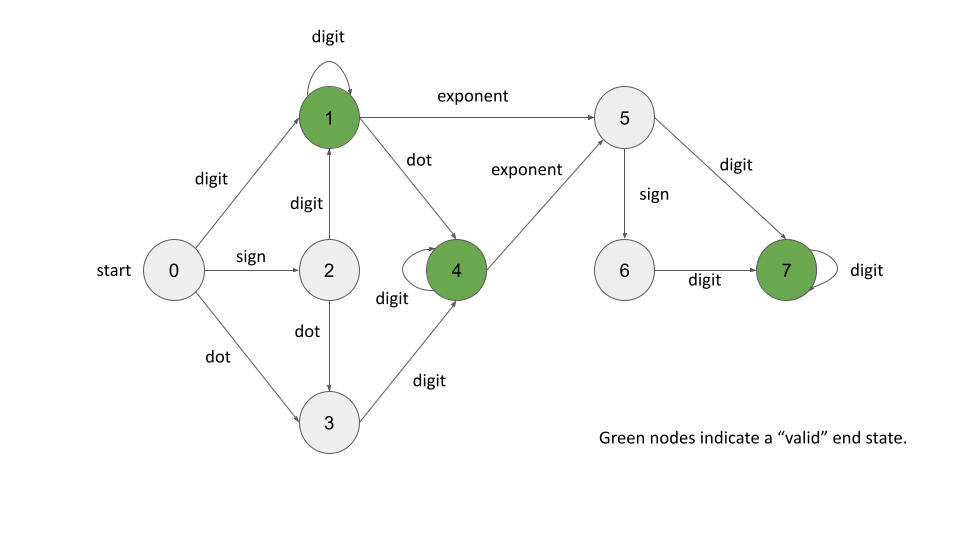

**65. Valid Number**

```Tag : math/string/state machine```

**Description:**

A **valid number** can be split up into these components (in order):

1. A **decimal number** or an **integer**.

2. (Optional) An ```'e'``` or ```'E'```, followed by an **integer**.

A **decimal number** can be split up into these components (in order):

1. (Optional) A sign character (either ```'+'``` or ```'-'```).

2. One of the following formats:

	1. One or more digits, followed by a dot ```'.'```.

	2. One or more digits, followed by a dot ```'.'```, followed by one or more digits.

	3. A dot ```'.'```, followed by one or more digits.

An **integer** can be split up into these components (in order):

1. (Optional) A sign character (either ```'+'``` or ```'-'```).

2. One or more digits.

For example, all the following are valid numbers: ```["2", "0089", "-0.1", "+3.14", "4.", "-.9", "2e10", "-90E3", "3e+7", "+6e-1", "53.5e93", "-123.456e789"]```, while the following are not valid numbers: ```["abc", "1a", "1e", "e3", "99e2.5", "--6", "-+3", "95a54e53"]```.

Given a string ```s```, return ```true``` if s is a **valid number**.

**Example1:**

		Input: s = "0"
		Output: true

**Example2:**

		Input: s = "e"
		Output: false

**Example3:**

		Input: s = "."
		Output: false

**Example4:**

		Input: s = ".1"
		Output: true

-----------



```python
class Solution:
    def isNumber(self, s: str) -> bool:
        """
        We consider using a state machine approach to solve this problem elegantly
        There are many different ways to design the state and transition, 
        we follow the one in the below links:
        https://leetcode.com/problems/valid-number/solution/
        
        denote n := len(s)
        Time Complexity : O(n)
        Space Complexity : O(1)
        """
        
        # the state machine we designed
        state_map = [
                    {"digit" : 1, "sign" : 2, "dot" : 3},
                    {"digit" : 1, "dot" : 4, "exponent" : 5},
                    {"digit" : 1, "dot" : 3},
                    {"digit" : 4},
                    {"digit" : 4, "exponent" : 5},
                    {"sign" : 6, "digit" : 7},
                    {"digit" : 7},
                    {"digit" : 7}
        ]
        current_state = 0 # initial starting point
        for c in s:
            if c.isdigit():
                label = "digit"
            elif c in ['+', '-']:
                label = "sign"
            elif c in ['e', 'E']:
                label = "exponent"
            elif c == '.':
                label = "dot"
            else:
                return False
            
            if label not in state_map[current_state]:
                # not a valid state
                return False
            # state transition
            current_state = state_map[current_state][label]
        
        return current_state in [1, 4, 7]
```
