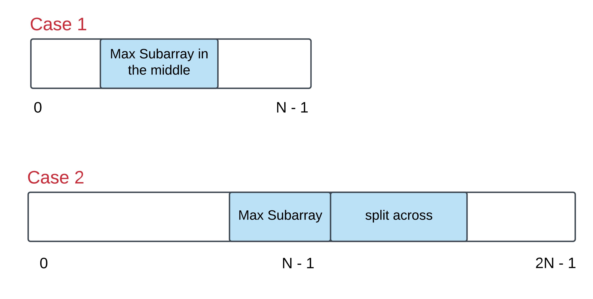

**918. Maximum Sum Circular Subarray**

```Tag : dynamic programming/monotone queue```

**Description:**

Given a **circular integer array** ```nums``` of length ```n```, return the maximum possible sum of a non-empty **subarray** of ```nums```.

A **circular array** means the end of the array connects to the beginning of the array. Formally, the next element of ```nums[i]``` is ```nums[(i + 1) % n]``` and the previous element of ```nums[i]``` is ```nums[(i - 1 + n) % n]```.

A **subarray** may only include each element of the fixed buffer ```nums``` at most once. Formally, for a subarray ```nums[i], nums[i + 1], ..., nums[j]```, there does not exist ```i <= k1, k2 <= j``` with ```k1 % n == k2 % n```.

**Example1:**

        Input: nums = [1,-2,3,-2]
        Output: 3
        Explanation: Subarray [3] has maximum sum 3

**Example2:**

        Input: nums = [5,-3,5]
        Output: 10
        Explanation: Subarray [5,5] has maximum sum 5 + 5 = 10
        
**Example3:**

        Input: nums = [3,-1,2,-1]
        Output: 4
        Explanation: Subarray [2,-1,3] has maximum sum 2 + (-1) + 3 = 4

**Example4:**

        Input: nums = [3,-2,2,-3]
        Output: 3
        Explanation: Subarray [3] and [3,-2,2] both have maximum sum 3
        
**Example5:**

        Input: nums = [-2,-3,-1]
        Output: -1
        Explanation: Subarray [-1] has maximum sum -1

**Hints**:

+ For those of you who are familiar with the **Kadane's algorithm**, think in terms of that. For the newbies, Kadane's algorithm is used to finding the maximum sum subarray from a given array. This problem is a twist on that idea and it is advisable to read up on that algorithm first before starting this problem. Unless you already have a great algorithm brewing up in your mind in which case, go right ahead!

+ What is an alternate way of representing a circular array so that it appears to be a straight array? Essentially, there are two cases of this problem that we need to take care of. Let's look at the figure below to understand those two cases: 



+ The first case can be handled by the good old Kadane's algorithm. However, is there a smarter way of going about handling the second case as well?

-----------

**Solution1: Dynamic Programming**

```python
class Solution:
    def maxSubarraySumCircular(self, nums: List[int]) -> int:
        """
        By allowing circular, essentially we consider concantenate the array once more time to itself
        However, we should consider only subarray of length at most n, otherwise it bumps into itself
        we know the answer is in one of the two forms:
        1) index [i, j] 0 <= i < j <= n-1
        2) index [0, i] + [j, n-1] 0 <= i, i+2 <= j <= n-1
        We solve these two subproblems
    
        denote n := len(nums)
        Time Complexity : O(n)
        Space Complexity : O(n)
        """
        n = len(nums)
        ans = curr = nums[0]
        for num in nums[1:]:
            # dp[i] = max(dp[i-1], 0) + nums[i]
            curr = max(curr, 0) + num
            ans = max(ans, curr) # try update answer for 1-interval subproblem
        
        # denote rightsums[i] = sum(nums[i] + nums[i+1] + ... + nums[n-1])
        rightsums = [None] * n
        rightsums[-1] = nums[-1]
        for i in range(n-2, -1, -1):
            rightsums[i] = nums[i] + rightsums[i+1]
        
        # denote rightmax[i] = max(rightsums[i], rightsums[i+1], ... rightsums[n-1])
        rightmax = [None] * n
        rightmax[-1] = rightsums[-1]
        for i in range(n-2, -1, -1):
            rightmax[i] = max(rightmax[i+1], rightsums[i])
        
        leftsum = 0
        for i in range(n-2):
            leftsum += nums[i]
            ans = max(ans, leftsum + rightmax[i+2])
        
        return ans
```

-----------

**Solution2: Monotone Queue**

```python
class Solution:
    def maxSubarraySumCircular(self, nums: List[int]) -> int:
        """
        Another way of solving this problem is to use Monotone queue
        we concantenate the nums by itself, and construct the presum[i], 0 <= i < 2n-1
        We want the maximal presum[j] - presum[i] such that j - i <= n (don't bump into itself)
        we use a monotone stack to simulate the process
        
        denote n := len(nums)
        Time Complexity : O(n)
        Space Complexity : O(n)
        """
        from collections import deque
        
        n = len(nums)
        presum = [0]
        for i in range(2 * n):
            presum.append(presum[-1] + nums[i%n])
        ans = nums[0]
        queue = deque([0])
        for i in range(1, len(presum)):
            if queue[0] < i - n:
                # pop out outdated value
                queue.popleft()
            # try to update
            ans = max(ans, presum[i] - presum[queue[0]])
            
            # insert current number into its proper position
            # to maintain that the queue is increasing from left to right
            while queue and presum[i] <= presum[queue[-1]]:
                queue.pop()
            
            queue.append(i)
        return ans
```
