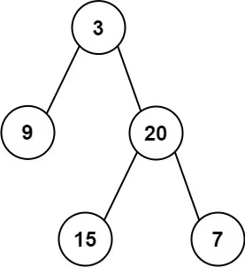

**105. Construct Binary Tree from Preorder and Inorder Traversal**

```Tag: Tree/DFS```

**Description:**

Given two integer arrays ```preorder``` and ```inorder``` where ```preorder``` is the ```preorder``` traversal of a binary tree and ```inorder``` is the inorder traversal of the same tree, construct and return the binary tree.


**Example1**:



                Input: preorder = [3,9,20,15,7], inorder = [9,3,15,20,7]
                Output: [3,9,20,null,null,15,7]

**Example2**:

                Input: preorder = [-1], inorder = [-1]
                Output: [-1]

-----------

```python
# Definition for a binary tree node.
# class TreeNode:
#     def __init__(self, val=0, left=None, right=None):
#         self.val = val
#         self.left = left
#         self.right = right
class Solution:
    def buildTree(self, preorder: List[int], inorder: List[int]) -> TreeNode:
        """
        This is a tree traversal understanding question
        We need to recall that:
        preorder : [root, [root's left subtree], [root's right subtree]]
        inorder : [[root's left subtree], root, [root's right subtree]]
        We want to recursively construct the tree using the preorder list, 
        but we need information from inorder list that how long is [left subtree] & [right subtree]
        
        denote n := len(preorder)
        Time Complexity : O(n)
        Space Complexity : O(n)
        """
        def build_tree(pre_left: int, pre_right: int, in_left: int, in_right: int) -> TreeNode:
            """Helper function: recursively build the tree"""
            if pre_left > pre_right: # boundary checking
                return None
            pre_root = pre_left # the pre_left will be the current root node
            in_root = index[preorder[pre_root]] # find the index of root node in in-order list
            root = TreeNode(val=preorder[pre_root])
            left_subtree_size = in_root - in_left
            
            # build left subtree
            root.left = build_tree(pre_left+1, pre_left+left_subtree_size, in_left, in_root-1)
            
            # build right subtree
            root.right = build_tree(pre_left+left_subtree_size+1, pre_right, in_root+1, in_right)

            return root
            
        
        n = len(preorder)
        index = {val : i for i, val in enumerate(inorder)} # hashing the inorder list
        root = build_tree(0, n-1, 0, n-1)
        return root  
```
