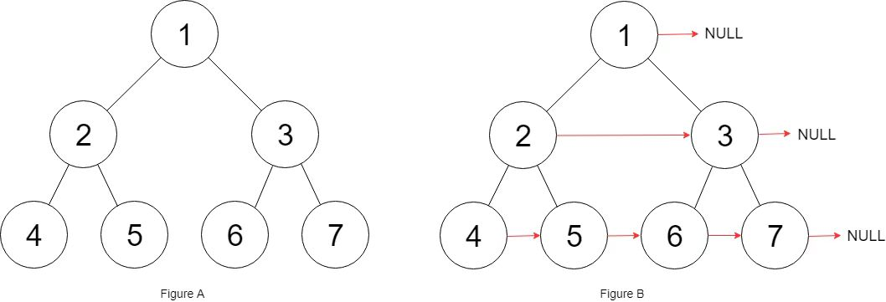

**116. Populating Next Right Pointers in Each Node**

```Tag: Tree/BFS/DFS```

**Description:**

You are given a **perfect binary tree** where all leaves are on the same level, and every parent has two children. The binary tree has the following definition:

        struct Node {
        int val;
        Node *left;
        Node *right;
        Node *next;
        }

Populate each next pointer to point to its next right node. If there is no next right node, the next pointer should be set to ```NULL```.

Initially, all next pointers are set to ```NULL```.

**Follow up**:

+ You may only use constant extra space.
+ Recursive approach is fine, you may assume implicit stack space does not count as extra space for this problem.

**Example1**:



        Input: root = [1,2,3,4,5,6,7]
        Output: [1,#,2,3,#,4,5,6,7,#]
        Explanation: Given the above perfect binary tree (Figure A), your function should populate each next pointer to point to its next right node, just like in Figure B. The serialized output is in level order as connected by the next pointers, with '#' signifying the end of each level.

-----------

```python
# Definition for a Node.
class Node:
    def __init__(self, val: int = 0, left: 'Node' = None, right: 'Node' = None, next: 'Node' = None):
        self.val = val
        self.left = left
        self.right = right
        self.next = next

class Solution:
    def connect(self, root: 'Node') -> 'Node':
        """
        This is a tree problem
        It is not hard to think of node.left.next = node.right
        But it is difficult to cross different nodes, for example
             1
            / \
            2 3
           /\  /\
           4 5 6 7
        how to make the links from 5 to 6
        here we need to track both the previous node and current node
        and traversal the tree level by level
        
        denote N := number of nodes in the tree
        Time Complexity : O(N)
        Space Complexity : O(1)
        """
        if not root:
            return root
        start = root # the beginning of every level
        prev, curr = root, None
        
        while prev.left:
            if not curr: # prev is the end of this level
                prev.left.next = prev.right
                prev, curr, start = start.left, start.right, start.left # update to next level
            else:
                prev.left.next = prev.right
                prev.right.next = curr.left
                prev, curr = prev.next, curr.next
                
        return root
```
