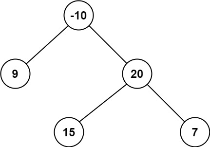

**124. Binary Tree Maximum Path Sum**

```Tag: Tree/DFS/Recursion```

**Description:**

A **path** in a binary tree is a sequence of nodes where each pair of adjacent nodes in the sequence has an edge connecting them. A node can only appear in the sequence **at most once**. Note that the path does not need to pass through the root.

The **path sum** of a path is the sum of the node's values in the path.

Given the ```root``` of a binary tree, return the **maximum path sum** of any path.

**Example1**:


        Input: root = [1,2,3]
        Output: 6
        Explanation: The optimal path is 2 -> 1 -> 3 with a path sum of 2 + 1 + 3 = 6.
  

**Example2**:



        Input: root = [-10,9,20,null,null,15,7]
        Output: 42
        Explanation: The optimal path is 15 -> 20 -> 7 with a path sum of 15 + 20 + 7 = 42.
        
-----------

```python
# Definition for a binary tree node.
# class TreeNode:
#     def __init__(self, val=0, left=None, right=None):
#         self.val = val
#         self.left = left
#         self.right = right
class Solution:
    def maxPathSum(self, root: TreeNode) -> int:
        """
        This is actually a tree dynamic programming problem using recursion
        we will create a new field associate with each node called "self.maxPath"
        it denotes the maximum Path Sum including the node in the path
        the self.maxPath will be init with value self.val
        if the node.left.maxPath > 0, add it
        if the node.right.maxPath > 0, add it
        Then in the end, we traversal each node in the tree and search for the max Path sum
        notice that in return process of recursion, you can only choose 1 side of subtree to add
        otherwise "a loop" is created and it's not a valid path
        denote N:= the number of nodes in the tree
        Time Complexity : O(N)
        Space Complexity : O(N)
        """
        def cal_max_path(node: TreeNode) -> int:
            """Recursively calculate the max Path sum for every node in the tree"""
            nonlocal maxPathSum
            if not node: # reach leaf node
                return 0
            # val represent the max path val with the current node as "highest point" of such a path
            # no more pass value upward
            val = node.val
            # get left and right children's max Path sum including themselves
            left_val = cal_max_path(node.left) 
            right_val = cal_max_path(node.right)
            # connect such a path if positive
            if left_val > 0: 
                val += left_val
            if right_val > 0:
                val += right_val
            # try update global maximum path sum
            maxPathSum = max(maxPathSum, val)
            # only choose one side to pass back recursively
            # avoid a closed loop
            return max(0, node.val + max(left_val, right_val))
        
        maxPathSum = float("-inf")      
        cal_max_path(root)
        return maxPathSum  
```
