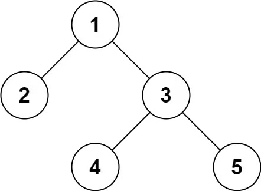

**297. Serialize and Deserialize Binary Tree**

```Tag: Tree/Design```

**Description:**

Serialization is the process of converting a data structure or object into a sequence of bits so that it can be stored in a file or memory buffer, or transmitted across a network connection link to be reconstructed later in the same or another computer environment.

Design an algorithm to serialize and deserialize a binary tree. There is no restriction on how your serialization/deserialization algorithm should work. You just need to ensure that a binary tree can be serialized to a string and this string can be deserialized to the original tree structure.

**Clarification**: The input/output format is the same as how LeetCode serializes a binary tree. You do not necessarily need to follow this format, so please be creative and come up with different approaches yourself.


**Example1**:



        Input: root = [1,2,3,null,null,4,5]
        Output: [1,2,3,null,null,4,5]

**Example2**:

        Input: root = []
        Output: []

**Example3**:

        Input: root = [1]
        Output: [1]

**Example4**:

        Input: root = [1,2]
        Output: [1,2]

-----------

**Solution1: O(2^h)** (exceeds time limit in test)

```python
"""
# Definition for a Node.
class Node:
    def __init__(self, val: int = 0, left: 'Node' = None, right: 'Node' = None, next: 'Node' = None):
        self.val = val
        self.left = left
        self.right = right
"""

class Codec:
    """
    Time Complexity : O(2^h) where h is the height of tree
    Space Complexity : O(2^h)
    this is the reason why exceeds time limit, in case of highly-imbalanced linked-list-like tree
    """ 

    def serialize(self, root):
        """Encodes a tree to a single string.
        
        :type root: TreeNode
        :rtype: str

        Level by level BFS, needs 2^h slots where h := the height of the tree
        """
        if not root: # boundary case
            return ""

        ans = [] # init the serialize result
        end = True # indicator of if a whole level is None
        queue = [root]
        while queue:
            newQueue = []
            for node in queue: # traversal this level
                if node is not None:
                    end = False
                    ans.append(str(node.val)) # string-ization
                    newQueue.append(node.left)
                    newQueue.append(node.right)
                else: # node is None
                    ans.append('*') # place-holder
                    newQueue.append(None)
                    newQueue.append(None)
            if end: # nothing in next level
                break
            else:
                end = True # reset
                queue = newQueue
        
        return " ".join(ans) # easy for later reconstruction using split()


    def deserialize(self, data):
        """Decodes your encoded data to tree.
        
        :type data: str
        :rtype: TreeNode

        BFS level by level construct the tree, using index to find parent
        """
        if not data: # boundary case
            return None
        
        nodes = data.split()
        res = []
        for i, string in enumerate(nodes):
            if string == '*': # a null place-holder
                res.append(None)
            else:
                res.append(TreeNode(val=int(string)))
                if i != 0: # find parent
                    parent = (i-1) // 2
                    if i % 2 == 0: # right child
                        res[parent].right = res[i]
                    else: # left child
                        res[parent].left = res[i]
                        
        return res[0] # root node  
```

-----------

**Solution2: O(n)**

```python
class Codec:
    """
    Time Complexity : O(n)
    Space Complexity : O(n)
    """
    def serialize(self, root):
        """Encodes a tree to a single string.
        
        :type root: TreeNode
        :rtype: str
        """
        if not root:
            return ""
        ans = []
        queue = collections.deque([root])
        while queue:
            node = queue.popleft()
            if node:
                ans.append(str(node.val))
                queue.append(node.left)
                queue.append(node.right)
            else:
                ans.append('*')
        return "|".join(ans)

    def deserialize(self, data):
        """Decodes your encoded data to tree.
        
        :type data: str
        :rtype: TreeNode
        """
        if not data:
            return None
        vals = data.split('|')
        root = TreeNode(val=int(vals[0]))
        i = 1
        queue = collections.deque([root])
        while queue:
            node = queue.popleft()
            if vals[i] != '*':
                node.left = TreeNode(val=int(vals[i]))
                queue.append(node.left)
            i += 1
            if vals[i] != '*':
                node.right = TreeNode(val=int(vals[i]))
                queue.append(node.right)
            i += 1
        return root
```
