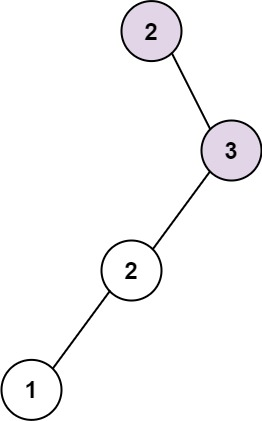

**298. Binary Tree Longest Consecutive Sequence**

```Tag : tree/recursion/dfs```

**Description:**

Given the ```root``` of a binary tree, return *the length of the longest consecutive sequence path*.

The path refers to any sequence of nodes from some starting node to any node in the tree along the parent-child connections. The longest consecutive path needs to be from parent to child (cannot be the reverse).

**Example1:**


        Input: root = [1,null,3,2,4,null,null,null,5]
        Output: 3
        Explanation: Longest consecutive sequence path is 3-4-5, so return 3.

**Example2:**



        Input: root = [2,null,3,2,null,1]
        Output: 2
        Explanation: Longest consecutive sequence path is 2-3, not 3-2-1, so return 2.

-----------

```python
# Definition for a binary tree node.
# class TreeNode:
#     def __init__(self, val=0, left=None, right=None):
#         self.val = val
#         self.left = left
#         self.right = right
class Solution:
    def longestConsecutive(self, root: Optional[TreeNode]) -> int:
        """
        We consider adopting a recursion solution here
        for each node, we compute the longest consecutive length that must contain the node value itself
        we recur on current node's left subtree and right subtree to retrieve the longest consecutive from them
        if the current node is +1(left) or -1(right), we could append them to form a longer one
        
        denote n := number of nodes in the binary tree, h := height of the binary tree
        Time Complexity : O(n) process each node only once
        Space Complexity : O(h) but in worst case if tree is highly skewed, it could be O(n)
        """
        Max = 0
        def recur(node: TreeNode) -> int:
            nonlocal Max
            if not node: # boundary checking
                return 0
            maxConsecutive = 1
            if node.left:
                leftMax = recur(node.left)
                if node.val == node.left.val - 1:
                    maxConsecutive = max(maxConsecutive, 1 + leftMax)
            if node.right:
                rightMax = recur(node.right)
                if node.val == node.right.val - 1:
                    maxConsecutive = max(maxConsecutive, 1 + rightMax)
            Max = max(Max, maxConsecutive) # update the global maximum
            return maxConsecutive # return the max consecutive length starting with current node
        
        recur(root)
        return Max
```

