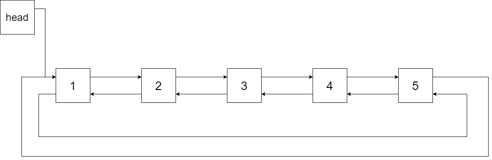
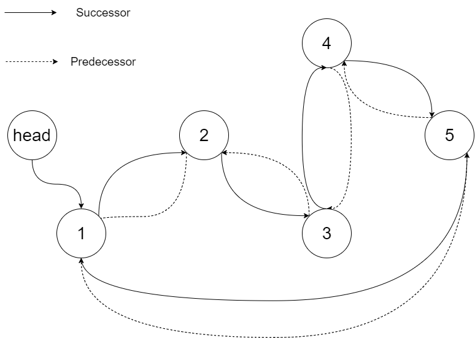

**426. Convert Binary Search Tree to Sorted Doubly Linked List**

```Tag : Tree/recursion/doubly-linked list```

**Description:**

Convert a **Binary Search Tree** to a sorted **Circular Doubly-Linked List** in place.

You can think of the left and right pointers as synonymous to the predecessor and successor pointers in a doubly-linked list. For a circular doubly linked list, the predecessor of the first element is the last element, and the successor of the last element is the first element.

We want to do the transformation **in place**. After the transformation, the left pointer of the tree node should point to its predecessor, and the right pointer should point to its successor. You should return the pointer to the smallest element of the linked list.

**Example1:**


		Input: root = [4,2,5,1,3]

		Output: [1,2,3,4,5]

		Explanation: The figure below shows the transformed BST. The solid line indicates the successor relationship, while the dashed line means the predecessor relationship.

**Example2:**
	
		Input: root = [2,1,3]
		Output: [1,2,3]

**Example3:**

		Input: root = []
		Output: []
		Explanation: Input is an empty tree. Output is also an empty Linked List.

**Example4:**

		Input: root = [1]
		Output: [1]

-----------

```python
"""
# Definition for a Node.
class Node:
    def __init__(self, val, left=None, right=None):
        self.val = val
        self.left = left
        self.right = right
"""

class Solution:
    def treeToDoublyList(self, root: 'Node') -> 'Node':
        """
        We use a recursion approach to solve this problem
        we maintain two records: last and first
        we will first process the left subtree,
        doubly link the current node and the last node in left subtree
        and then update current node to be the 'last' and recursion on right subtree
        Finally, we need to close the loop by joining first and last node
        
        denote n := number of nodes in the tree
        Time Complexity : O(n) process each node once
        Space Complexity : O(n) worst case if unbalanced tree
        """
        def recur(node: 'Node') -> None:
            nonlocal first, last
            if node:
                # deal with the left subtree
                recur(node.left)
                
                if last:
                    # last is the biggest node that's smaller than current node
                    last.right = node
                    node.left = last
                else: 
                    # record the smallest node so far
                    # at the beginning we will go all the way left
                    # till the smallest node
                    first = node
                
                last = node
                recur(node.right)
        
        if not root: # boundary case checking
            return root
        first, last = None, None
        recur(root)
        first.left = last
        last.right=first
        
        return first
```
